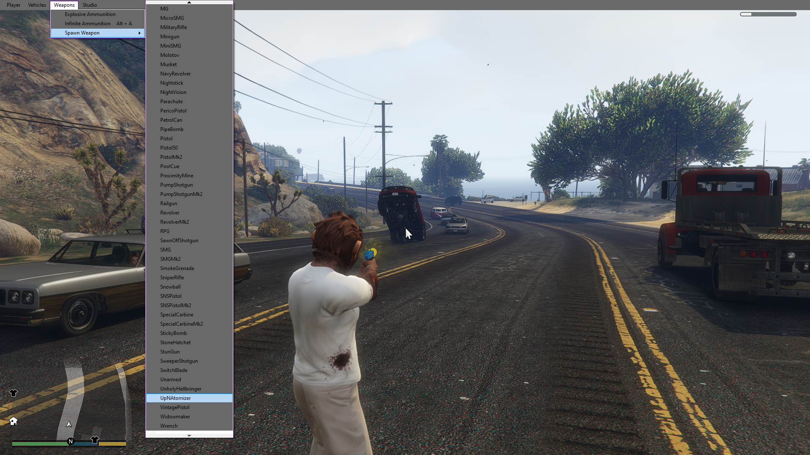

# GTA V Studio

GTA V Studio for Mods/Cheats/Trainers

> The crazier the better! :smirk:

## Requirements

- [Community Script Hook V .NET](https://github.com/crosire/scripthookvdotnet)

## Showcase




## Contribution

### Environment Setup & Building

1. Install all requirements.

2. If your local GTA V executable location is not in `C:\Program Files\Rockstar Games\Grand Theft Auto V` you need to
   set the environment variable `GTAVLocation` to your specific location.

3. Make sure there is a `scripts` folder in your GTA V folder.

4. Open the solution with either Microsoft Visual Studio or JetBrains Rider and build it.

5. All required files will be automatically copied to the above mentioned `scripts` folder.

### Reloading after new build (without closing the Game)

1. Create a `ScriptHookVDotNet.ini` file in your GTA V folder with the following content:

```ini
ReloadKey = Insert
```

2. Now you can reload all .NET Scripts depending on Community Script Hook V .NET by pressing the `INSERT` key.

### Troubleshooting

- Depending on the system your IDE and the Game itself (including the launcher and every wrapper, e.g. Steam/Epic Games...) will require administrative permissions on the GTA V folder.

- There are a couple of log files in your GTA V folder which can be helpful:

    - `ScriptHookVDotNet.log` (Logs from the .NET script hook)
    - `ScriptHookV.log` (Logs from the general script hook written in C++)
    - `asiloader.log` (Logs from the ASI loader which loads the script hooks)
    
- There are also logs for your Rockstar Games launcher in your `%userprofile%\Documents\Rockstar Games\Launcher` folder. 

### Coding Conventions

A few rules to follow when contributing on this project:

- Nearly everything which the user can interact with should be configurable. (Using the .ini files)

- Translations are always welcome, but at least include the english default translations in the `GTAVStudio.en-US.ini`
  file. (For later translation)

- Management UI is strictly separated from in-game UI (See `OverlayForm.cs`)

- General C# Coding Conventions apply
